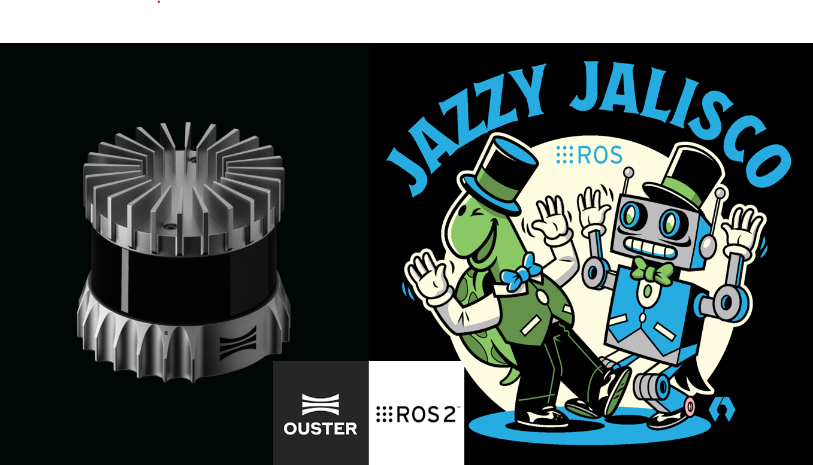

<p align="center">
  
</p>

<br/>

# Ouster ROS 2 Driver and CycloneDDS Setup
### Step-by-step installation, tuning, and validation on Ubuntu 24.04 LTS with ROS 2 Jazzy Jalisco

A complete, beginner-friendly, end-to-end tutorial to install the official **Ouster ROS 2 driver** alongside the **Eclipse CycloneDDS** middleware on **Ubuntu 24.04 LTS** with **ROS 2 Jazzy Jalisco**.

This guide walks through every step required to bring up an Ouster sensor — OS0, OS1 or OS2 — under ROS 2 Jazzy, configure CycloneDDS for high-density point clouds (typical of an OS0-128 streaming at 20 Hz), tune the Linux kernel UDP buffers to avoid packet loss, and validate the full pipeline before connecting the physical sensor.

> ⚠️ **This tutorial is not a replacement for the official Ouster, ROS 2 and CycloneDDS documentation.** It is a practical, opinionated shortcut to help you get a robust setup running in minutes rather than days. For in-depth specifications, advanced configuration, and the complete API reference, always refer to the official resources linked at the end of this guide.

> Target use cases: mobile robotics, 3D mapping, nuclear and industrial inspection, SLAM benchmarking, simulation in Gazebo / Isaac Sim, and any workflow that requires a reliable Ouster ROS 2 pipeline on Ubuntu 24.04.

> 💡 **Looking for the Ubuntu 22.04 + ROS 2 Humble version?** See the companion repository: [Ouster_Driver_CycloneDDS_Ubuntu_22.04_ROS2_Humble](https://github.com/BENKRID-abdenour/Ouster_Driver_CycloneDDS_Ubuntu_22.04_ROS2_Humble).

---

## Table of Contents

1. [Tested Configuration](#tested-configuration)
2. [Workflow Overview](#workflow-overview)
3. [Step 1 — Verify ROS 2 Jazzy Installation](#step-1--verify-ros-2-jazzy-installation)
4. [Step 2 — Update the System](#step-2--update-the-system)
5. [Step 3 — Install the Ouster ROS 2 Driver](#step-3--install-the-ouster-ros-2-driver)
6. [Step 4 — Install CycloneDDS](#step-4--install-cyclonedds)
7. [Step 5 — Identify Network Interfaces](#step-5--identify-network-interfaces)
8. [Step 6 — Create the CycloneDDS Configuration File](#step-6--create-the-cyclonedds-configuration-file)
9. [Step 7 — Increase Kernel UDP Buffers](#step-7--increase-kernel-udp-buffers)
10. [Step 8 — Activate CycloneDDS via `.bashrc`](#step-8--activate-cyclonedds-via-bashrc)
11. [Step 9 — Validate DDS Communication](#step-9--validate-dds-communication)
12. [Step 10 — First Launch with the Physical Sensor](#step-10--first-launch-with-the-physical-sensor)
13. [Published ROS 2 Topics](#published-ros-2-topics)
14. [Useful Commands — Record, Replay and PCAP](#useful-commands--record-replay-and-pcap)
15. [3D → 2D Conversion for SLAM Toolbox](#3d--2d-conversion-for-slam-toolbox)
16. [Multi-Machine Configuration](#multi-machine-configuration)
17. [Troubleshooting](#troubleshooting)
18. [Recommended Settings Summary](#recommended-settings-summary)
19. [Project Files Created](#project-files-created)
20. [Official Resources](#official-resources)
21. [License](#license)

---

## Tested Configuration

### Sensors

- **Ouster OS0 — Rev7 / 128 channels** (firmware 3.x)
- **Ouster OS1 — Rev6 / 64 channels** (firmware 2.x)
- **Ouster OS1 — Rev7 / 64–128 channels** (firmware 3.x)

### Host system

- **Ubuntu 24.04 LTS (Noble Numbat)**
- **ROS 2 Jazzy Jalisco** (LTS, supported until May 2029)
- **`ros-jazzy-ouster-ros`** version `0.14.1` or newer
- **`ros-jazzy-rmw-cyclonedds-cpp`** version `2.2.3` or newer
- **`ros-jazzy-cyclonedds`** version `0.10.5` or newer
- **Linux kernel** 6.8+

> Throughout this guide, replace `<SENSOR_HOSTNAME>` with the hostname of your sensor (for example `os-122448002665.local`). The 12-digit serial number is printed on a label on top of the sensor.

> Throughout this guide, replace `enp4s0` (Ethernet) and `wlp3s0` (Wi-Fi) with the actual network interface names of your machine. They are identified in [Step 5](#step-5--identify-network-interfaces).

---

## Workflow Overview

```text
Verify ROS 2 → Update System → Install Driver → Install CycloneDDS →
Identify Interfaces → Configure CycloneDDS → Tune Kernel Buffers →
Activate in .bashrc → Validate DDS → Connect Sensor → Stream Point Clouds
```

1. Verify that ROS 2 Jazzy is correctly installed
2. Bring the system up to date
3. Install the official `ouster-ros` driver via `apt`
4. Install the CycloneDDS middleware via `apt`
5. Identify the Ethernet and Wi-Fi interfaces on the host
6. Write a tuned CycloneDDS configuration file
7. Raise the kernel UDP receive buffers to absorb dense point-cloud bursts
8. Activate CycloneDDS persistently through `.bashrc`
9. Validate DDS communication without the sensor
10. Connect the physical Ouster sensor and confirm the topic rates

---

## Step 1 — Verify ROS 2 Jazzy Installation

Before installing anything, confirm that ROS 2 Jazzy is properly sourced and reachable from your shell.

```bash
source /opt/ros/jazzy/setup.bash
printenv ROS_DISTRO
ros2 pkg list 2>/dev/null | head -5
```

**Expected output:**

- `printenv ROS_DISTRO` → `jazzy`
- `ros2 pkg list` displays the first ROS 2 packages (`action_msgs`, `action_tutorials_cpp`, …)

> 💡 **Note.** The command `ros2 --version` does not exist in ROS 2 — this is normal. Use `printenv ROS_DISTRO` to confirm the active distribution.

If ROS 2 Jazzy is not installed yet, follow the [official installation guide](https://docs.ros.org/en/jazzy/Installation/Ubuntu-Install-Debs.html) before continuing.

---

## Step 2 — Update the System

Bring `apt` package metadata and installed packages up to date.

```bash
sudo apt update
sudo apt upgrade -y
```

This step is short but important: working with mismatched versions of `ros-jazzy-*` packages is a common source of subtle bugs.

---

## Step 3 — Install the Ouster ROS 2 Driver

The official driver is published by Ouster and packaged for ROS 2 Jazzy by Open Robotics.

```bash
sudo apt install ros-jazzy-ouster-ros -y
```

### 3.1 Verify the installation

```bash
dpkg -l ros-jazzy-ouster-ros | tail -1
ls $(ros2 pkg prefix ouster_ros)/share/ouster_ros/launch/
```

**Expected output:**

- A line starting with `ii` showing the installed version (for example `0.14.1`)
- A directory listing containing the following launch files:

```text
driver.launch.py             record.launch.xml            replay_pcap.launch.xml
driver_launch.py             replay.composite.launch.xml  rviz.launch.py
record.composite.launch.xml  replay.launch.xml            rviz.launch.xml
sensor.composite.launch.py   sensor.composite.launch.xml  sensor.launch.xml
sensor_mtp.launch.xml
```

> 💡 **Why `apt` rather than building from source?** The Debian package is officially maintained, signed, and reproducible across machines. Build from source only when you need a feature that has not yet been packaged, or when you need to modify the driver itself.

---

## Step 4 — Install CycloneDDS

ROS 2 Jazzy ships with **Fast DDS** as the default middleware. For high-density point clouds (OS0-128 streaming at 20 Hz produces around 80 MB/s of fragmented UDP traffic), **CycloneDDS** is significantly more robust against packet loss.

### 4.1 Install the CycloneDDS RMW

```bash
sudo apt install ros-jazzy-rmw-cyclonedds-cpp -y
```

This single command pulls in everything needed: `ros-jazzy-cyclonedds`, `ros-jazzy-rmw-cyclonedds-cpp`, and the Iceoryx shared-memory dependencies.

### 4.2 Verify the installation

```bash
dpkg -l ros-jazzy-rmw-cyclonedds-cpp | tail -1
dpkg -l ros-jazzy-cyclonedds | tail -1
ros2 doctor --report 2>/dev/null | grep cyclonedds
```

**Expected output:**

- `ros-jazzy-rmw-cyclonedds-cpp` version `2.2.3` or newer
- `ros-jazzy-cyclonedds` version `0.10.5` or newer
- A line of the form `rmw_cyclonedds_cpp : latest=X.X.X, local=X.X.X`

> ⚠️ **At this stage CycloneDDS is installed but not yet active.** Both middlewares coexist on the system, and the default RMW is still Fast DDS. CycloneDDS is activated through environment variables in [Step 8](#step-8--activate-cyclonedds-via-bashrc).

### 4.3 Why CycloneDDS for the Ouster

| Aspect | Fast DDS (default) | CycloneDDS |
|--------|-------------------|------------|
| Architecture | Peer-to-peer | Peer-to-peer |
| Multicast discovery | Yes | Yes |
| Behavior on fragmented UDP bursts | Conservative defaults, can drop packets | More aggressive buffering, recommended for dense LiDAR |
| Adoption in mobile robotics | Widespread | Widespread, often preferred for LiDAR |
| Official ROS 2 support | Yes (default) | Yes (alternative) |

For OS0-128 at 20 Hz, every point cloud is around 4 MB fragmented into about 60 UDP packets. **A single dropped packet discards the whole point cloud.** CycloneDDS combined with the kernel buffer tuning of [Step 7](#step-7--increase-kernel-udp-buffers) produces a noticeably more stable stream than the default Fast DDS configuration.

---

## Step 5 — Identify Network Interfaces

List the network interfaces available on the host:

```bash
ip -br link show
```

**Example output:**

```text
lo               UNKNOWN        00:00:00:00:00:00 <LOOPBACK,UP,LOWER_UP>
enp4s0           DOWN           98:ee:cb:94:78:78 <NO-CARRIER,BROADCAST,MULTICAST,UP>
wlp3s0           UP             1c:1b:b5:91:42:ae <BROADCAST,MULTICAST,UP,LOWER_UP>
```

| Interface type | Typical name | Role in this setup |
|----------------|-------------|---------------------|
| Loopback | `lo` | Inter-node communication on the same machine (automatic) |
| Wired Ethernet | `enpXsY` / `enoX` | Ouster sensor (UDP), multi-machine LAN |
| Wi-Fi | `wlpXsY` | Multi-machine over a wireless network |

**Take note of the exact names** of your Ethernet and Wi-Fi interfaces — they are needed in [Step 6](#step-6--create-the-cyclonedds-configuration-file).

### 5.1 Confirm the sensor interface (optional)

Once the Ouster is physically connected, you can confirm the right interface is receiving its packets:

```bash
sudo apt install tcpdump -y
sudo tcpdump -i enp4s0 -c 5 udp port 7502
```

If UDP packets scroll by, you are looking at the correct interface.

---

## Step 6 — Create the CycloneDDS Configuration File

CycloneDDS reads its configuration from an XML file pointed to by the `CYCLONEDDS_URI` environment variable. Create a dedicated configuration tuned for Ouster and multi-interface hosts.

```bash
mkdir -p ~/.ros
nano ~/.ros/cyclonedds.xml
```

Paste the following content, **replacing `enp4s0` and `wlp3s0` with your own interface names**:

```xml
<?xml version="1.0" encoding="UTF-8" ?>
<CycloneDDS xmlns="https://cdds.io/config"
            xmlns:xsi="http://www.w3.org/2001/XMLSchema-instance"
            xsi:schemaLocation="https://cdds.io/config https://raw.githubusercontent.com/eclipse-cyclonedds/cyclonedds/master/etc/cyclonedds.xsd">
    <Domain Id="any">
        <General>
            <Interfaces>
                <NetworkInterface name="enp4s0" priority="default" multicast="default" presence_required="false"/>
                <NetworkInterface name="wlp3s0" priority="default" multicast="default" presence_required="false"/>
            </Interfaces>
            <AllowMulticast>default</AllowMulticast>
            <MaxMessageSize>65500B</MaxMessageSize>
        </General>
        <Internal>
            <SocketReceiveBufferSize min="10MB"/>
            <Watermarks>
                <WhcHigh>500kB</WhcHigh>
            </Watermarks>
        </Internal>
    </Domain>
</CycloneDDS>
```

Save the file with `Ctrl+O`, then `Enter`, then `Ctrl+X` to exit.

### 6.1 Parameter reference

| Parameter | Role |
|-----------|------|
| `NetworkInterface` | Interfaces CycloneDDS is allowed to use |
| `presence_required="false"` | Allows CycloneDDS to start even if a listed interface is `DOWN` |
| `AllowMulticast` | Enables automatic peer discovery on the LAN |
| `MaxMessageSize 65500B` | Allows full-size fragmented UDP packets |
| `SocketReceiveBufferSize min="10MB"` | Receive buffer requested from the kernel |
| `WhcHigh 500kB` | Writer history cache high-water mark, important for large publishers |

> ⚠️ **`presence_required="false"` is critical** on development laptops where the Ethernet cable is not always plugged in. Without it, CycloneDDS refuses to start as soon as any listed interface is `DOWN`, breaking even simple ROS 2 commands.

### 6.2 Verify the file

```bash
cat ~/.ros/cyclonedds.xml
```

A copy of this configuration is also available in the [`configs/`](configs/) folder of this repository.

---

## Step 7 — Increase Kernel UDP Buffers

This step is the one most often forgotten — and it is the single biggest cause of packet drops on dense LiDARs.

When the Ouster sends a point cloud, the Linux kernel queues the UDP packets in a socket buffer before CycloneDDS reads them. **If that buffer is too small, the kernel drops packets before CycloneDDS ever sees them.** No middleware tuning can recover from that loss.

By default, `net.core.rmem_max` is around 200 KB on Ubuntu. We will raise it to 2 GB.

### 7.1 Create the sysctl file

```bash
sudo nano /etc/sysctl.d/10-cyclone-max.conf
```

Paste the following content:

```text
net.core.rmem_max=2147483647
net.core.rmem_default=2147483647
net.ipv4.ipfrag_time=3
net.ipv4.ipfrag_high_thresh=134217728
```

### 7.2 Apply without rebooting

```bash
sudo sysctl -p /etc/sysctl.d/10-cyclone-max.conf
```

### 7.3 Verify

```bash
sysctl net.core.rmem_max net.core.rmem_default net.ipv4.ipfrag_time net.ipv4.ipfrag_high_thresh
```

**Expected output:**

```text
net.core.rmem_max = 2147483647
net.core.rmem_default = 2147483647
net.ipv4.ipfrag_time = 3
net.ipv4.ipfrag_high_thresh = 134217728
```

> 💡 **These settings persist across reboots.** The file in `/etc/sysctl.d/` is loaded automatically by systemd at boot time.

### 7.4 Parameter reference

| Parameter | Role |
|-----------|------|
| `net.core.rmem_max` | Maximum receive buffer CycloneDDS may request (2 GB ceiling) |
| `net.core.rmem_default` | Default buffer size allocated to new sockets |
| `net.ipv4.ipfrag_time` | Maximum time a partial IP fragment is kept (3 s instead of the default 30 s) |
| `net.ipv4.ipfrag_high_thresh` | Maximum amount of memory used for fragment reassembly (128 MB) |

A copy of this file is also available in the [`configs/`](configs/) folder of this repository.

---

## Step 8 — Activate CycloneDDS via `.bashrc`

Up to this point, CycloneDDS is installed and configured but not active. We now wire it into every shell session.

### 8.1 Inspect what is already in `.bashrc`

```bash
grep -E "ROS|RMW|CYCLONE" ~/.bashrc
```

Make a note of whether `source /opt/ros/jazzy/setup.bash` is already present — it must appear **only once** in the file.

### 8.2 Edit `.bashrc`

```bash
nano ~/.bashrc
```

Append the following block at the very end of the file. **If `source /opt/ros/jazzy/setup.bash` is already present higher up in the file, do not duplicate it** — leave the `source` line out of the block below.

```bash

# =========================
# ROS 2 Jazzy
# =========================
# (Skip this line if Jazzy is already sourced earlier in this file.)
source /opt/ros/jazzy/setup.bash

# =========================
# DDS Middleware — CycloneDDS
# =========================
export RMW_IMPLEMENTATION=rmw_cyclonedds_cpp
export CYCLONEDDS_URI=file://$HOME/.ros/cyclonedds.xml

# ROS Domain — change this if multiple teams share the same LAN
export ROS_DOMAIN_ID=0
```

Save and exit (`Ctrl+O`, `Enter`, `Ctrl+X`).

### 8.3 Reload the shell

```bash
source ~/.bashrc
```

### 8.4 Verify

```bash
echo "RMW    = $RMW_IMPLEMENTATION"
echo "URI    = $CYCLONEDDS_URI"
echo "Domain = $ROS_DOMAIN_ID"
ros2 doctor --report 2>/dev/null | grep -A1 "RMW MIDDLEWARE"
```

**Expected output:**

```text
RMW    = rmw_cyclonedds_cpp
URI    = file:///home/<user>/.ros/cyclonedds.xml
Domain = 0
   RMW MIDDLEWARE
middleware name    : rmw_cyclonedds_cpp
```

✅ CycloneDDS is now the active ROS 2 middleware on this machine.

> ⚠️ **Every terminal must source `.bashrc` to inherit these variables.** If a node is launched from an IDE or a systemd unit that does not source `.bashrc`, it will fall back to Fast DDS and will not see any topic published by your other CycloneDDS nodes. Always double-check with `echo $RMW_IMPLEMENTATION` in each new terminal during debugging sessions.

---

## Step 9 — Validate DDS Communication

This sanity check confirms that pub/sub, node discovery, and DDS transport all work — without needing the physical sensor.

### 9.1 Terminal 1 — Publisher

```bash
ros2 topic pub /test_cyclone std_msgs/String "data: hello cyclone $(date +%T)" -r 5
```

**Expected output:** continuous lines of the form

```text
publisher: beginning loop
publishing #1: std_msgs.msg.String(data='hello cyclone 14:32:01')
...
```

Leave this terminal running.

### 9.2 Terminal 2 — Subscriber

```bash
ros2 topic echo /test_cyclone
```

**Expected output:**

```text
data: hello cyclone 14:32:01
---
data: hello cyclone 14:32:01
---
```

### 9.3 Terminal 3 — Introspection

```bash
ros2 topic list
ros2 topic info /test_cyclone
ros2 topic hz /test_cyclone
```

**Expected output:**

- `ros2 topic list` shows `/test_cyclone`, `/parameter_events` and `/rosout`
- `ros2 topic info` reports `Type: std_msgs/msg/String`, `Publisher count: 1`, `Subscription count: ≥1`
- `ros2 topic hz` reports `average rate: 5.000`

Stop all three terminals with `Ctrl+C`.

> 💡 **What this proves.** A successful test confirms that node creation, DDS transport, automatic discovery, and the local loopback path are all working. Any ROS 2 node — including the Ouster driver — will now use CycloneDDS through the same pipeline.

---

## Step 10 — First Launch with the Physical Sensor

This is the final step: confirm that the entire stack works end-to-end with the actual Ouster sensor.

### 10.1 Prerequisites

- The sensor is powered (PoE+ injector or sensor PoE switch).
- The sensor is connected to the host's Ethernet interface (`enp4s0` in our example).
- The Ethernet interface is `UP` (check with `ip -br link show enp4s0`).

### 10.2 Discover the sensor on the network

Ouster sensors advertise their hostname via mDNS:

```bash
sudo apt install avahi-utils -y
avahi-browse -art | grep ouster
```

Alternatively, ping the sensor by hostname (replace with your serial):

```bash
ping -4 os-<SERIAL>.local
```

### 10.3 Launch the driver

```bash
ros2 launch ouster_ros sensor.launch.xml \
    sensor_hostname:=os-<SERIAL>.local \
    viz:=true
```

If everything is correctly configured, RViz2 opens automatically and the point cloud appears within a few seconds.

### 10.4 Validate the topic rates

In a separate terminal:

```bash
ros2 topic hz /ouster/points
ros2 topic hz /ouster/imu
ros2 topic bw /ouster/points
```

**Expected output:**

- `/ouster/points` → stable 10 Hz or 20 Hz (depending on `lidar_mode`)
- `/ouster/imu` → stable 100 Hz
- `/ouster/points` → consistent bandwidth (40–80 MB/s for OS0-128 at 20 Hz)

### 10.5 Check for kernel-level drops

```bash
netstat -su | grep -i "receive buffer errors"
```

During a healthy run, **this counter should not increase**. If it does, revisit [Step 7](#step-7--increase-kernel-udp-buffers) and confirm that `net.core.rmem_max` is set to 2 GB.

---

## Published ROS 2 Topics

Once the driver is running, the following topics are published. The most important for SLAM and downstream perception are highlighted.

| Topic | Type | Usage |
|-------|------|-------|
| **`/ouster/points`** | `sensor_msgs/PointCloud2` | **3D dense point cloud — used by KISS-ICP, FAST-LIO2, LIO-SAM, RTAB-Map** |
| **`/ouster/imu`** | `sensor_msgs/Imu` | **100 Hz IMU — required by FAST-LIO2 and LIO-SAM** |
| `/ouster/scan` | `sensor_msgs/LaserScan` | Single ring of the lidar — **not** a horizontal projection. See note below |
| `/ouster/range_image` | `sensor_msgs/Image` | Depth image — useful for debugging and ML |
| `/ouster/signal_image` | `sensor_msgs/Image` | Reflectance intensity image |
| `/ouster/nearir_image` | `sensor_msgs/Image` | Near-IR image — useful in low-light nuclear and industrial inspection |
| `/ouster/reflec_image` | `sensor_msgs/Image` | Calibrated reflectivity image |
| `/ouster/metadata` | `std_msgs/String` | Sensor JSON metadata |
| `/tf`, `/tf_static` | `tf2_msgs/TFMessage` | Static and dynamic frame transforms |

> ⚠️ **A common pitfall:** `/ouster/scan` is **not** a 360° horizontal projection of the point cloud. It is a single elevation ring of the LiDAR, configurable via the `scan_ring` parameter. For 2D SLAM (for example with SLAM Toolbox), use `pointcloud_to_laserscan` instead — see [3D → 2D Conversion for SLAM Toolbox](#3d--2d-conversion-for-slam-toolbox).

---

## Useful Commands — Record, Replay and PCAP

### Record a rosbag

```bash
ros2 launch ouster_ros record.launch.xml \
    sensor_hostname:=os-<SERIAL>.local \
    bag_file:=capture_$(date +%Y%m%d_%H%M%S)
```

> 💡 **In ROS 2, a bag is a directory**, not a single `.bag` file as in ROS 1. The directory contains `metadata.yaml` plus one or more `.db3` (SQLite) or `.mcap` files.

For SLAM datasets, MCAP is the recommended format — it is faster to replay and portable across ROS 2 distributions:

```bash
ros2 bag record -s mcap \
    /ouster/points /ouster/imu /tf /tf_static
```

### Replay a rosbag

```bash
ros2 launch ouster_ros replay.launch.xml \
    bag_file:=/path/to/capture_XXXXXXXX \
    metadata:=/path/to/metadata.json
```

> ⚠️ **The Ouster sensor metadata JSON is required for replay.** It is normally captured automatically alongside the rosbag. Without it, the replayed point clouds will be geometrically incorrect.

### Replay a PCAP file

```bash
ros2 launch ouster_ros replay_pcap.launch.xml \
    pcap_file:=/path/to/file.pcap \
    metadata:=/path/to/file.json
```

PCAP is the native Ouster format for sharing datasets — it captures the raw UDP stream as the sensor emitted it, independently of ROS.

### Launch without visualization (saves CPU)

```bash
ros2 launch ouster_ros sensor.launch.xml \
    sensor_hostname:=os-<SERIAL>.local \
    viz:=false
```

---

## 3D → 2D Conversion for SLAM Toolbox

SLAM Toolbox is a 2D SLAM stack and expects a `sensor_msgs/LaserScan` input. As mentioned above, `/ouster/scan` is a single elevation ring and is therefore poorly suited for proper 2D mapping. The recommended approach is to project a horizontal slice of the 3D point cloud into a synthetic `LaserScan`.

### Install `pointcloud_to_laserscan`

```bash
sudo apt install ros-jazzy-pointcloud-to-laserscan -y
```

### Example launch file

```python
from launch import LaunchDescription
from launch_ros.actions import Node

def generate_launch_description():
    return LaunchDescription([
        Node(
            package='pointcloud_to_laserscan',
            executable='pointcloud_to_laserscan_node',
            name='pc_to_scan',
            remappings=[('cloud_in', '/ouster/points'),
                        ('scan', '/scan')],
            parameters=[{
                'target_frame': 'base_link',
                'transform_tolerance': 0.01,
                'min_height': -0.2,
                'max_height': 0.3,
                'angle_min': -3.14159,
                'angle_max':  3.14159,
                'angle_increment': 0.0087,
                'scan_time': 0.1,
                'range_min': 0.5,
                'range_max': 50.0,
                'use_inf': True,
                'concurrency_level': 2,
            }]
        )
    ])
```

### Key parameters

| Parameter | Effect |
|-----------|--------|
| `target_frame` | Frame in which the slice is taken — usually `base_link` so the slice stays horizontal regardless of sensor tilt |
| `min_height` / `max_height` | Vertical thickness of the slice projected to 2D |
| `angle_increment` | Angular resolution of the synthetic scan (0.0087 rad ≈ 0.5°) |
| `range_max` | Maximum range — match to the sensor's reliable range in your environment |

> 💡 **Tilted lidars (e.g. on Spot).** Setting `target_frame: base_link` is what makes this approach robust — the slice is taken in the robot's horizontal plane, even when the LiDAR itself is physically tilted on the platform.

---

## Multi-Machine Configuration

The configuration described above works on a single machine. For a multi-machine setup (e.g. a development laptop talking to an embedded robot PC), a few additional points apply.

### Same RMW everywhere

All machines must use the same RMW implementation. Mixing CycloneDDS and Fast DDS produces nodes that do not see each other.

```bash
echo $RMW_IMPLEMENTATION   # must return rmw_cyclonedds_cpp on every machine
```

### Same `ROS_DOMAIN_ID`

```bash
echo $ROS_DOMAIN_ID   # must be identical on every machine
```

### Multicast must be reachable

CycloneDDS discovers peers via UDP multicast. Most consumer Wi-Fi routers block or rate-limit multicast traffic, which silently breaks discovery between machines.

| Connection type | Multicast reliability |
|-----------------|-----------------------|
| Direct Ethernet crossover cable | ✅ Excellent |
| Managed switch | ✅ Excellent |
| Dedicated unmanaged switch | ✅ Good |
| Home Wi-Fi router | ⚠️ Often unreliable |

For serious multi-robot work, prefer a wired connection or a dedicated switch.

### Per-host interface tuning

The CycloneDDS XML file from [Step 6](#step-6--create-the-cyclonedds-configuration-file) must be adapted on each machine to match its actual interface names. Run `ip -br link show` on every host and update the `NetworkInterface name="…"` entries accordingly.

---

## Troubleshooting

### `enpXsY: does not match an available interface`

CycloneDDS refuses to start because an interface listed in the XML is `DOWN` or absent.

**Fix:** add `presence_required="false"` to every `NetworkInterface` entry in `~/.ros/cyclonedds.xml`, as shown in [Step 6](#step-6--create-the-cyclonedds-configuration-file).

### Topics are not visible between two terminals on the same machine

Check that both terminals have inherited the CycloneDDS environment variables:

```bash
echo $RMW_IMPLEMENTATION   # rmw_cyclonedds_cpp
echo $CYCLONEDDS_URI       # file:///home/<user>/.ros/cyclonedds.xml
```

If one of them returns an empty string or `rmw_fastrtps_cpp`, run `source ~/.bashrc` in that terminal.

### Visible packet drops on `/ouster/points`

1. Check kernel UDP buffers:
   ```bash
   sysctl net.core.rmem_max   # must return 2147483647
   ```
2. Check kernel-level drop counter during a run:
   ```bash
   netstat -su | grep "receive buffer errors"
   ```
   If this counter grows during the run, the buffer is still too small or the CPU is saturated.

3. Confirm CycloneDDS is the active middleware:
   ```bash
   ros2 doctor --report 2>/dev/null | grep -A1 "RMW MIDDLEWARE"
   ```

### Sensor not reachable by hostname

- Confirm that `avahi-daemon` is running: `systemctl status avahi-daemon`
- Make sure `libnss-mdns` is installed: `sudo apt install libnss-mdns`
- Try resolving with the explicit `.local` suffix: `ping -4 os-<SERIAL>.local`
- Fall back to the sensor's IP address if mDNS is blocked on your LAN

### Multi-machine discovery does not work

- Confirm both machines use the same `RMW_IMPLEMENTATION` and `ROS_DOMAIN_ID`
- Test multicast manually: `iperf -s -u -B 239.255.0.1 -i 1` on one host, matching client on the other
- If multicast is blocked by the LAN, configure CycloneDDS in **unicast peers** mode (advanced — see CycloneDDS documentation)

---

## Recommended Settings Summary

### File locations

| File | Role |
|------|------|
| `~/.ros/cyclonedds.xml` | CycloneDDS configuration (network interfaces, buffers) |
| `/etc/sysctl.d/10-cyclone-max.conf` | Kernel UDP buffer tuning (persistent) |
| `~/.bashrc` (modified) | Activation of `RMW_IMPLEMENTATION` and `CYCLONEDDS_URI` |

### Environment variables

| Variable | Recommended value |
|----------|-------------------|
| `RMW_IMPLEMENTATION` | `rmw_cyclonedds_cpp` |
| `CYCLONEDDS_URI` | `file://$HOME/.ros/cyclonedds.xml` |
| `ROS_DOMAIN_ID` | `0` (change if sharing a LAN) |

### Kernel parameters

| Parameter | Value |
|-----------|-------|
| `net.core.rmem_max` | `2147483647` (2 GB) |
| `net.core.rmem_default` | `2147483647` (2 GB) |
| `net.ipv4.ipfrag_time` | `3` seconds |
| `net.ipv4.ipfrag_high_thresh` | `134217728` (128 MB) |

---

## Project Files Created

This setup creates three files on the host system:

```text
~/.ros/cyclonedds.xml                       # CycloneDDS config
/etc/sysctl.d/10-cyclone-max.conf           # Kernel UDP buffers
~/.bashrc (modified)                        # RMW + URI environment variables
```

Reference copies of the first two files are included in this repository under [`configs/`](configs/) for reuse on other machines.

---

## Official Resources

- [Ouster ROS 2 Driver — GitHub](https://github.com/ouster-lidar/ouster-ros)
- [Ouster Sensor Documentation](https://static.ouster.dev/sensor-docs/)
- [Ouster SDK Documentation](https://static.ouster.dev/sdk-docs/)
- [ROS 2 Jazzy Documentation](https://docs.ros.org/en/jazzy/)
- [ROS 2 DDS Tuning Guide](https://docs.ros.org/en/jazzy/How-To-Guides/DDS-tuning.html)
- [Eclipse CycloneDDS — GitHub](https://github.com/eclipse-cyclonedds/cyclonedds)
- [`pointcloud_to_laserscan` — GitHub](https://github.com/ros-perception/pointcloud_to_laserscan)

---

## License

This tutorial is provided as a technical reference for robotics, mapping, and SLAM workflows using Ouster LiDAR sensors with ROS 2 and CycloneDDS. You are welcome to adapt it to your own projects — attribution is appreciated.
